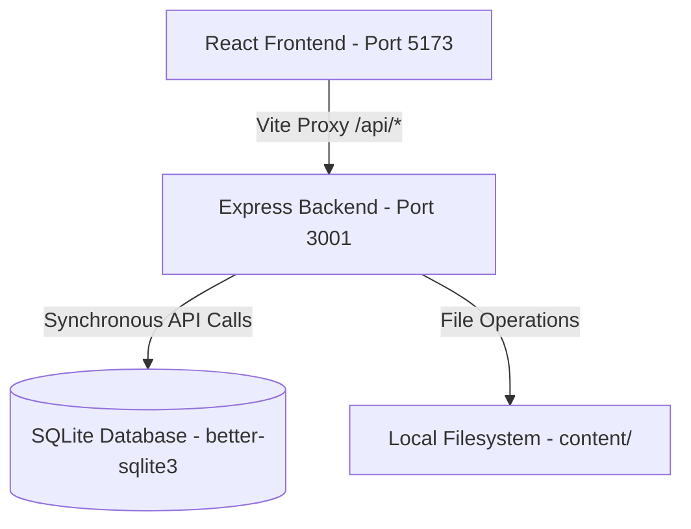

# DC Mastery Hub — Technical System Context & Specification

This specification serves as the comprehensive source-of-truth document for the **DC Mastery Hub** application. It details the system architecture, database schema, algorithms, directory layout, core workflows, and development constraints.

---

## 1. System Architecture



### Technology Stack
*   **Frontend**: React 18, Vite, Tailwind CSS, React Router, Recharts, Lucide-React.
*   **Backend**: Node.js + Express.js (ESM modules).
*   **Database**: SQLite via the `better-sqlite3` library.
*   **Routing & Proxy**: The Vite development server proxies relative `/api/*` paths to `http://localhost:3001` via the configuration in `vite.config.js`.

---

## 2. Critical Implementation Rules & Constraints
Any developer or AI agent modifying this codebase **must** adhere to the following rules:
1.  **Synchronous SQLite API**: The `better-sqlite3` library is fully synchronous. **Do not use `async`/`await` or Promises** for database queries. Use `db.prepare().get()`, `.all()`, and `.run()` synchronously.
2.  **Backend Error Handling**: Every backend route handler must be completely wrapped in a `try/catch` block and delegate errors to the Express error middleware (`next(err)`).
3.  **UI Design & Color Variables**: Never hardcode hex values for styling. Use predefined CSS variables:
    *   `--bg-primary` (main background color)
    *   `--bg-card` (card background color)
    *   `--bg-sidebar` (sidebar background color)
    *   `--accent-green` (`#03ef62` / highlighting success)
    *   `--accent-red` (failure/warnings)
    *   `--accent-yellow` (medium level/in-progress warnings)
    *   `--accent-blue` (info)
    *   `--text-primary` (primary text)
    *   `--text-muted` (faded labels/notes)
    *   `--border` (component outline color)
4.  **Relative API Paths**: Frontend API calls must always use relative paths starting with `/api/` (e.g., fetch `/api/tracks/associate-data-scientist-python`).
5.  **No New Packages**: Do not add new npm packages unless explicitly requested.

---

## 3. Database Schema Reference

The SQLite database uses the following table structure to model tracks, courses, concepts, exercises, attempts, and progress:

### A. Core Schema Tables

#### `users`
*   `id`: `INTEGER PRIMARY KEY AUTOINCREMENT`
*   `username`: `TEXT UNIQUE NOT NULL` (e.g., email address)
*   `password_hash`: `TEXT NOT NULL` (PBKDF2 SHA-512 representation)
*   `salt`: `TEXT NOT NULL` (unique 16-byte hex value)
*   `is_admin`: `INTEGER DEFAULT 0` (1 for administrator, 0 for standard user)
*   `created_at`: `TEXT DEFAULT (datetime('now'))`

#### `sessions`
*   `id`: `TEXT PRIMARY KEY` (cryptographically secure session token)
*   `user_id`: `INTEGER NOT NULL REFERENCES users(id)`
*   `expires_at`: `TEXT NOT NULL`

#### `tracks`
*   `id`: `INTEGER PRIMARY KEY AUTOINCREMENT`
*   `slug`: `TEXT UNIQUE NOT NULL` (e.g., `associate-data-scientist-python`)
*   `name`: `TEXT NOT NULL`
*   `description`: `TEXT`
*   `language`: `TEXT` (e.g., `Python`, `SQL`)
*   `color`: `TEXT` (hex code styling used dynamically in UI)
*   `is_deleted`: `INTEGER DEFAULT 0`
*   `is_archived`: `INTEGER DEFAULT 0`
*   `created_at`: `TEXT DEFAULT (datetime('now'))`

#### `courses`
*   `id`: `INTEGER PRIMARY KEY AUTOINCREMENT`
*   `slug`: `TEXT NOT NULL` (e.g., `working-with-dates-and-times-in-python`)
*   `name`: `TEXT NOT NULL`
*   `difficulty`: `TEXT DEFAULT 'Unknown'`
*   `status`: `TEXT DEFAULT 'Not Started'`
*   `notes`: `TEXT`
*   `reviewed`: `TEXT DEFAULT 'No'`
*   `has_pdf`: `INTEGER DEFAULT 0`
*   `has_glossary`: `INTEGER DEFAULT 0`
*   `is_deleted`: `INTEGER DEFAULT 0`
*   `is_archived`: `INTEGER DEFAULT 0`
*   `created_at`: `TEXT DEFAULT (datetime('now'))`

#### `track_courses` (Junction Table)
*   `track_id`: `INTEGER NOT NULL REFERENCES tracks(id)`
*   `course_id`: `INTEGER NOT NULL REFERENCES courses(id)`
*   `order_in_track`: `INTEGER`
*   `PRIMARY KEY (track_id, course_id)`

#### `concepts`
*   `id`: `INTEGER PRIMARY KEY AUTOINCREMENT`
*   `course_id`: `INTEGER REFERENCES courses(id)`
*   `name`: `TEXT NOT NULL`
*   `definition`: `TEXT`
*   `code_snippet`: `TEXT`
*   `source_page`: `INTEGER`
*   `category`: `TEXT`
*   `difficulty`: `INTEGER DEFAULT 1`
*   `created_at`: `TEXT DEFAULT (datetime('now'))`

#### `flashcards`
*   `id`: `INTEGER PRIMARY KEY AUTOINCREMENT`
*   `concept_id`: `INTEGER REFERENCES concepts(id)`
*   `course_id`: `INTEGER REFERENCES courses(id)`
*   `front`: `TEXT NOT NULL`
*   `back`: `TEXT NOT NULL`
*   `next_review_date`: `TEXT DEFAULT (date('now'))`
*   `interval_days`: `INTEGER DEFAULT 1`
*   `ease_factor`: `REAL DEFAULT 2.5`
*   `repetitions`: `INTEGER DEFAULT 0`

#### `quiz_questions`
*   `id`: `INTEGER PRIMARY KEY AUTOINCREMENT`
*   `course_id`: `INTEGER REFERENCES courses(id)`
*   `concept_id`: `INTEGER REFERENCES concepts(id)`
*   `question_text`: `TEXT NOT NULL`
*   `option_a`: `TEXT`
*   `option_b`: `TEXT`
*   `option_c`: `TEXT`
*   `option_d`: `TEXT`
*   `correct_option`: `TEXT`
*   `explanation`: `TEXT`
*   `question_type`: `TEXT` (e.g. `scenario`, `comparison`, `code_analysis`)
*   `difficulty`: `INTEGER DEFAULT 1`

### B. User Progress & Session Data Tables

#### `user_tracks`
*   `user_id`: `INTEGER NOT NULL REFERENCES users(id)`
*   `track_id`: `INTEGER NOT NULL REFERENCES tracks(id)`
*   `is_deleted`: `INTEGER DEFAULT 0`
*   `is_archived`: `INTEGER DEFAULT 0`
*   `PRIMARY KEY (user_id, track_id)`

#### `user_courses`
*   `user_id`: `INTEGER NOT NULL REFERENCES users(id)`
*   `course_id`: `INTEGER NOT NULL REFERENCES courses(id)`
*   `status`: `TEXT DEFAULT 'Not Started'` (completed status overrides)
*   `difficulty`: `TEXT DEFAULT 'Unknown'`
*   `notes`: `TEXT`
*   `reviewed`: `TEXT DEFAULT 'No'`
*   `is_deleted`: `INTEGER DEFAULT 0`
*   `is_archived`: `INTEGER DEFAULT 0`
*   `PRIMARY KEY (user_id, course_id)`

#### `user_flashcard_progress`
*   `user_id`: `INTEGER NOT NULL REFERENCES users(id)`
*   `flashcard_id`: `INTEGER NOT NULL REFERENCES flashcards(id)`
*   `interval_days`: `INTEGER DEFAULT 1`
*   `ease_factor`: `REAL DEFAULT 2.5`
*   `repetitions`: `INTEGER DEFAULT 0`
*   `next_review_date`: `TEXT DEFAULT (date('now'))`
*   `PRIMARY KEY (user_id, flashcard_id)`

#### `user_stats`
*   `id`: `INTEGER PRIMARY KEY AUTOINCREMENT`
*   `user_id`: `INTEGER UNIQUE REFERENCES users(id)`
*   `total_xp`: `INTEGER DEFAULT 0`
*   `level`: `TEXT DEFAULT 'Beginner'`
*   `current_streak`: `INTEGER DEFAULT 0`
*   `longest_streak`: `INTEGER DEFAULT 0`
*   `last_active_date`: `TEXT`
*   `badges_json`: `TEXT DEFAULT '[]'`

#### `spaced_repetition_queue`
*   `id`: `INTEGER PRIMARY KEY AUTOINCREMENT`
*   `user_id`: `INTEGER NOT NULL REFERENCES users(id)`
*   `flashcard_id`: `INTEGER NOT NULL REFERENCES flashcards(id)`
*   `due_date`: `TEXT`
*   `priority`: `INTEGER DEFAULT 1`
*   `UNIQUE(user_id, flashcard_id)`

#### `mastery_scores`
*   `id`: `INTEGER PRIMARY KEY AUTOINCREMENT`
*   `user_id`: `INTEGER REFERENCES users(id)`
*   `course_id`: `INTEGER REFERENCES courses(id)`
*   `flashcard_score`: `REAL DEFAULT 0`
*   `quiz_score`: `REAL DEFAULT 0`
*   `code_score`: `REAL DEFAULT 0`
*   `dataset_score`: `REAL DEFAULT 0`
*   `matching_score`: `REAL DEFAULT 0`
*   `boss_score`: `REAL DEFAULT 0`
*   `incorrect_score`: `REAL DEFAULT 0`
*   `overall_mastery`: `REAL DEFAULT 0`
*   `updated_at`: `TEXT DEFAULT (datetime('now'))`
*   `UNIQUE(user_id, course_id)`

#### `exercise_attempts`
*   `id`: `INTEGER PRIMARY KEY AUTOINCREMENT`
*   `user_id`: `INTEGER REFERENCES users(id)`
*   `course_id`: `INTEGER REFERENCES courses(id)`
*   `exercise_type`: `TEXT NOT NULL` (e.g. `quiz`, `flashcard`, `fillblank`, `matching`, `bossbattle`, `dataset`)
*   `question_id`: `TEXT` (references respective item ID from JSON or DB)
*   `concept_id`: `TEXT` (optional concept reference)
*   `was_correct`: `INTEGER` (1 for correct, 0 for incorrect)
*   `attempted_at`: `TEXT DEFAULT (datetime('now'))`
*   `score`: `REAL` (decimal value e.g. for matching performance)

---

## 4. Spaced Repetition (SM-2 Algorithm)

Flashcards use the SuperMemo-2 (SM-2) algorithm to calculate optimal review intervals based on user responses:

1.  **Response Quality ($q$)**:
    *   `5`: Perfect response ($score \ge 1.0$)
    *   `4`: Correct response with hesitation ($score \ge 0.8$)
    *   `3`: Correct response with difficulty ($score \ge 0.5$)
    *   `1`: Incorrect response ($score < 0.5$)
2.  **Repetitions ($n$)**:
    *   If quality $q < 3$, reset $n = 0$ and set interval $I = 1$ day.
    *   If $q \ge 3$:
        *   If $n = 0 \rightarrow I = 1$ day.
        *   If $n = 1 \rightarrow I = 6$ days.
        *   If $n > 1 \rightarrow I = \text{round}(I \times EF)$ days.
        *   Increment repetitions $n = n + 1$.
3.  **Ease Factor ($EF$)**:
    *   $EF = EF + (0.1 - (5 - q) \times (0.08 + (5 - q) \times 0.02))$
    *   If $EF < 1.3$, it is capped at $1.3$.
4.  **Database Storage**: Updates are tracked in `user_flashcard_progress` per user-flashcard mapping.

---

## 5. Course Mastery Score Formulation

The overall course mastery score represents course progress on a scale of `0` to `100`. It is calculated using the weighted scoring breakdown of **7 exercise categories**:

| Exercise Category | Weight | Score Formula Basis |
| :--- | :---: | :--- |
| **Dataset Challenge** | **30%** | Percentage of solved unique coding challenges in the course |
| **Boss Battle** | **15%** | Average concept-level depth score for `bossbattle` attempts |
| **Fill in the Blank (FTB)** | **20%** | Average concept-level depth score for `fillblank` attempts |
| **Matching** | **10%** | Average score across matching round attempts (accuracy ratio) |
| **MCQ (Quiz)** | **15%** | Average concept-level depth score for `quiz` attempts |
| **Flashcards** | **5%** | Average concept-level depth score for `flashcard` attempts |
| **Incorrect Review** | **5%** | Percentage of completed incorrect exercises that have been resolved |

### Category Score Formulas
*   **Concept-level Depth Score** ($getScoreForType$):
    $$\text{Score} = \frac{1}{\text{Total Course Concepts}} \sum_{c \in \text{Course Concepts}} \text{Mastery}(c)$$
    Where the concept-level mastery $\text{Mastery}(c)$ for a given exercise type is:
    $$\text{Mastery}(c) = \frac{\text{Correct Attempts}}{\text{Correct} + 0.5 \times \text{Wrong}}$$
    *(If no attempts exist for concept $c$, $\text{Mastery}(c) = 0$)*
*   **Dynamic Compatibility**: If a course does not support a specific exercise category (e.g., it has no `challenge.json` or `matching.json` files), its score for that category defaults to **`100%`** so progress is not blocked.
*   **Overall Course Mastery Formula**:
    $$\text{Overall Mastery} = \min\left(100, \sum (\text{Category Score} \times \text{Category Weight})\right)$$

---

## 6. Directory Layout & Content Files

Static metadata, slide PDFs, and exercise JSON definitions are stored on disk under the `content/` folder:

```text
dc-mastery-hub/
├── backend/
│   ├── db/
│   │   ├── database.js          # Synchronous better-sqlite3 DB connection
│   │   ├── schema.js            # Database schema & user-progress migrations
│   │   └── seed.js              # Idempotent DB metadata seeder (tracks & courses)
│   ├── routes/
│   │   ├── auth.js              # User auth, login, register, cookie session setup
│   │   ├── content.js           # Directory scanning, text extraction, PDF server
│   │   ├── courses.js           # Course details, concepts, and questions loaders
│   │   ├── manage.js            # Course copy, trash, archive, custom course endpoints
│   │   └── progress.js          # User stats, dashboard aggregates, recalculation, incorrect queue
│   └── index.js                 # Express server startup entry point
├── content/
│   └── tracks/
│       └── [track-slug]/
│           ├── track.json       # Track slug, name, and programming language metadata
│           └── [course-slug]/
│               ├── [course-slug].pdf           # Naive lecture slide slides
│               ├── [course-slug]-glossary.pdf  # (Optional) Terminology glossary slides
│               ├── datasets/                   # CSV, pickle, sql, or pickle binaries
│               └── exercises/                  # Exercise templates (mcq, flashcards, etc.)
│                   ├── mcq.json
│                   ├── flashcards.json
│                   ├── ftb.json
│                   ├── matching.json
│                   ├── bossbattle.json
│                   └── challenge.json
```

### Important Slug Guidelines
*   **Course Folder Names & PDF Names**: Must match the database course slug exactly.
*   *Note*: The course "Working with Dates and Time in Python" uses the folder/file names `working-with-dates-and-times-in-python` (with plural "times") to align with the database records.

---

## 7. Content Scanner & JSON Importer

The backend uses automatic startup scan and import operations to seed course exercises:

1.  **Content Scanner (`contentScanner.js`)**:
    *   Scans `content/tracks/[track-slug]/[course-slug]/` to check if `[course-slug].pdf` or `[course-slug]-glossary.pdf` are present.
    *   Updates the `has_pdf` and `has_glossary` columns in the `courses` table if changes are detected.
2.  **JSON Importer (`jsonImporter.js`)**:
    *   Checks if concepts exist in the DB for a course. If empty, it attempts to load exercises from its `exercises/` folder.
    *   **Junction Table Routing**: Because a course can belong to multiple tracks, the importer queries the `track_courses` junction table to identify all track slugs associated with the course, checking all possible directory paths on disk until the active `exercises` folder is located.
    *   Parses and seeds the `concepts`, `flashcards`, and `quiz_questions` tables in a transaction.

---

## 8. Exercise File Validation (`validator.py`)
To prevent corrupt content imports, a python validator script is located at `project/validator.py`.
*   **Execution**: Run `./venv/bin/python validator.py <exercises_folder_path>`
*   **Validates**:
    *   JSON syntax and schema formatting requirements for all 6 exercise files (`mcq.json`, `flashcards.json`, `ftb.json`, `matching.json`, `bossbattle.json`, `challenge.json`).
    *   Unique IDs across all exercises.
    *   `total_questions`, `total_cards`, and `total_pairs` count integrity matches.
    *   Dataset challenge structures (`starter_code`, `solution_code`, `pre_loaded_data` as object, `validation_rules`).
